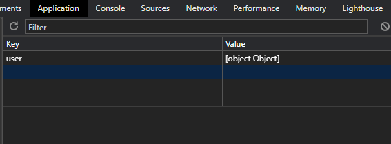

# Local Storage İçine Farklı Türde Veriler Ekleme

```bash
let user = "kodluyoruz" 
localStorage.setItem('userInfo', user)
``` 

User objesini localStorage'de tutmak için setItem() fonksiyonu yukarıdaki gibi kullanılabilir. localStorage içindeki görüntüsü aşağıdaki gibi olacaktır. Ancak daha kompleks objeler için bu kod satırı yetersizdir. 


 ```bash
let userStatus = {userName: 'kodluyoruz', isActive: true}
localStorage.setItem('user', user)
``` 
userStatus objesini bu halde eklemek istediğimizde aşağıdaki gibi tutulduğu görülür. 



Bunun sebebi localStorage içindeki bilgilerin key: value şeklinde, yalnızca string valueler ile saklanmasıdır. İlk örnekteki user değişkeni userInfo bilgisine atanabilir ancak userStatus bir obje olduğunda yukarıdaki sonuçla karşılaşırız. Bunu önlemek için userStatus objesini stringe çevirmek gereklidir.


 ```bash
let userStatus = {userName: 'kodluyoruz', isActive: true}
localStorage.setItem('user', JSON.stringify(userStatus))
``` 


